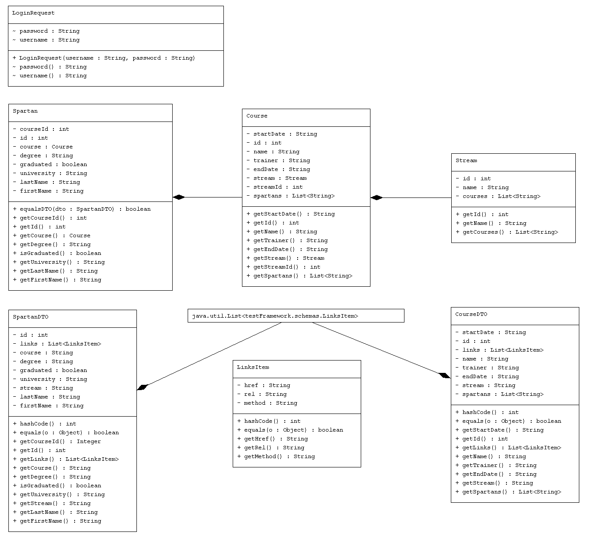
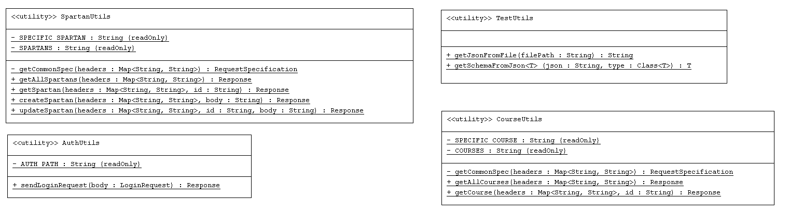
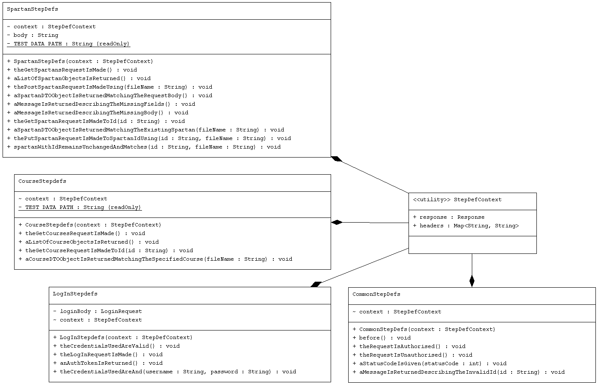

# Spartan API Testing

## Contents

1. [About](#about)
2. [Framework Architecture](#framework-architecture)
3. [Setup Instructions](#setup-instructions)
4. [User Guide](#user-guide)
5. [Contribution Guidelines](#user-guide)

## About
A java test automation framework for testing the Sparta Global Spartan API

## Framework Architecture

### Schemas

Bodies for requests and responses are represented using pojos based on the schemas from the Spartan API documentation 



### Utilities

Utility classes contain commonly used behaviour to be used in test step definition methods



### Step Definitions

Defines the steps to execute when running the Gherkin scripts.
Also shown is a context class to enable the sharing of state between step definition classes 
so that methods do not need to be duplicated across multiple classes



## Setup Instructions

### Requirements

- OpenJDK 22 
- Apache Maven 3.9.8

### Steps

1. Clone the repo using `git clone https://github.com/ChristianHarborow/SpartanAPITesting.git`
2. Create the config.properties file in the resources directory with the following contents (contact admin for credentials)
```
username=<username here>
password=<password here>
base_uri=<base uri here>
token=ToBeRetrieved
token_retrieved=2024-04-25T13:00:00
```
3. To build the project and run the tests run the following command in the projects top level directory

`mvn -B package --file pom.xml`
## User Guide
- To run tests run the command `mvn test`
- To select which tests you wish to run add or remove tags from the IncludeTags annotation in the TestRunner class
```java
@IncludeTags({
        "Course",  // now only tests with the @Course annotation will be run
//        "Login",
//        "Spartan"
})
```
- You can also add additional tags within the feature files
```
@Spartan
@Post
@NewFeatureLevelTag
Feature: As a user I need to be able to add new spartans
  @NewScenarioLevelTag
  Scenario: Create spartan using full valid body
```

## Contribution Guidelines
- See attached [project board](https://github.com/users/ChristianHarborow/projects/1) for planned feature tickets or create your own
- Assign chosen ticket
- Create new branch from dev branch
- Implement feature
- Create pull request
- Await review